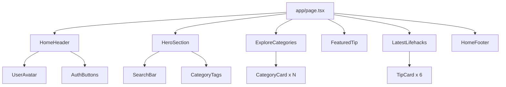

# Design Document: Home Page Implementation

## Overview

This design document outlines the technical approach for implementing the home page of the LifeHackBuddy application. The home page serves as the primary entry point for users, providing discovery of lifehacking tips through categories, featured content, and recent tips. The implementation follows Next.js 14+ App Router patterns with React Server Components where appropriate, TypeScript for type safety, and Tailwind CSS for styling.

The design emphasizes:
- **Separation of concerns**: Clear boundaries between UI components, data fetching, and business logic
- **Type safety**: Comprehensive TypeScript types matching the API schema
- **Responsive design**: Mobile-first approach with progressive enhancement
- **Performance**: Parallel data fetching and optimized rendering
- **Maintainability**: Reusable components following established patterns

## Architecture

### High-Level Structure

```
app/page.tsx (Client Component)
├── components/home/
│   ├── hero-section.tsx
│   ├── search-bar.tsx
│   ├── category-tags.tsx
│   ├── explore-categories.tsx
│   ├── category-card.tsx
│   ├── featured-tip.tsx
│   ├── latest-lifehacks.tsx
│   ├── tip-card.tsx
│   └── home-footer.tsx
├── components/layout/
│   └── home-header.tsx
├── lib/api/
│   ├── categories.ts
│   └── tips.ts
└── lib/types/
    └── api.ts
```

### Component Hierarchy



### Data Flow

1. **Page Load**: `app/page.tsx` initiates parallel API calls for categories and tips
2. **API Layer**: `lib/api/categories.ts` and `lib/api/tips.ts` handle HTTP requests
3. **State Management**: React useState hooks manage loading, error, and data states
4. **Component Rendering**: Data flows down to presentational components via props
5. **User Interaction**: Click handlers trigger Next.js navigation using `useRouter`

## Components and Interfaces

### 1. Main Page Component (`app/page.tsx`)

**Responsibility**: Orchestrate data fetching, manage page-level state, compose layout

**Type Definitions**:
```typescript
interface HomePageState {
  categories: Category[] | null;
  featuredTip: Tip | null;
  latestTips: Tip[];
  loading: boolean;
  error: string | null;
}
```

**Key Functions**:
- `fetchHomeData()`: Parallel fetch of categories and tips
- `handleRetry()`: Retry failed API requests
- Render loading, error, or success states

### 2. Home Header Component (`components/layout/home-header.tsx`)

**Responsibility**: Display navigation with authentication-aware UI

**Props**:
```typescript
interface HomeHeaderProps {
  user: FirebaseUser | null;
}
```

**Behavior**:
- Anonymous users: Show "Login" and "Join for Free" buttons
- Authenticated users: Show UserAvatar with dropdown menu
- Logo links to home page
- Responsive mobile menu

### 3. Hero Section Component (`components/home/hero-section.tsx`)

**Responsibility**: Display headline, subheadline, search bar, and category tags

**Props**:
```typescript
interface HeroSectionProps {
  onSearch?: (query: string) => void; // Optional for future implementation
}
```

**Composition**:
- Headline and subheadline text
- SearchBar component
- CategoryTags component

### 4. Search Bar Component (`components/home/search-bar.tsx`)

**Responsibility**: Render search input with button (non-functional placeholder)

**Props**:
```typescript
interface SearchBarProps {
  placeholder?: string;
  onSearch?: (query: string) => void;
  disabled?: boolean;
}
```

**State**:
- `searchQuery`: string for controlled input

### 5. Category Tags Component (`components/home/category-tags.tsx`)

**Responsibility**: Display static category filter badges

**Props**:
```typescript
interface CategoryTagsProps {
  tags: string[];
  onTagClick?: (tag: string) => void;
}
```

**Default Tags**: ["Popular", "Recommended", "Automotive", "Fashion"]

### 6. Explore Categories Component (`components/home/explore-categories.tsx`)

**Responsibility**: Display category grid with loading/error states

**Props**:
```typescript
interface ExploreCategoriesProps {
  categories: Category[] | null;
  loading: boolean;
  error: string | null;
  onRetry: () => void;
}
```

**Rendering Logic**:
- Loading: Show skeleton cards
- Error: Show error message with retry button
- Success: Render CategoryCard for each category

### 7. Category Card Component (`components/home/category-card.tsx`)

**Responsibility**: Display individual category with icon, name, and tip count

**Props**:
```typescript
interface CategoryCardProps {
  category: Category;
  tipCount?: number;
}
```

**Icon Mapping**:
```typescript
const CATEGORY_ICONS: Record<string, string> = {
  'Kitchen': '🍳',
  'Cleaning': '🧹',
  'Tech Help': '💻',
  'DIY Repair': '🔧',
  'Wellness': '🧘',
  // Default fallback
};
```

**Interaction**: Click navigates to `/category/${category.id}`

### 8. Featured Tip Component (`components/home/featured-tip.tsx`)

**Responsibility**: Display most recent tip in prominent card format

**Props**:
```typescript
interface FeaturedTipProps {
  tip: Tip | null;
  loading: boolean;
  error: string | null;
  onRetry: () => void;
}
```

**Layout**:
- Left side: Badge, title, description, action buttons
- Right side: Tip image
- Responsive: Stack vertically on mobile

### 9. Latest Lifehacks Component (`components/home/latest-lifehacks.tsx`)

**Responsibility**: Display grid of recent tips

**Props**:
```typescript
interface LatestLifehacksProps {
  tips: Tip[];
  loading: boolean;
  error: string | null;
  onRetry: () => void;
}
```

**Grid Layout**:
- Desktop: 3 columns
- Tablet: 2 columns
- Mobile: 1 column

### 10. Tip Card Component (`components/home/tip-card.tsx`)

**Responsibility**: Display individual tip summary

**Props**:
```typescript
interface TipCardProps {
  tip: Tip;
}
```

**Elements**:
- Tip image (with fallback)
- Title (truncated to 2 lines)
- Description (truncated to 3 lines)
- Category badge
- "Read tip >" link
- Heart icon (non-functional)

### 11. User Avatar Component (`components/layout/user-avatar.tsx`)

**Responsibility**: Display user initials in circular avatar

**Props**:
```typescript
interface UserAvatarProps {
  user: FirebaseUser;
  onClick?: () => void;
}
```

**Initials Logic**:
```typescript
function getInitials(user: FirebaseUser): string {
  if (user.displayName) {
    const parts = user.displayName.split(' ');
    if (parts.length >= 2) {
      return `${parts[0][0]}${parts[1][0]}`.toUpperCase();
    }
    return user.displayName.substring(0, 2).toUpperCase();
  }
  if (user.email) {
    return user.email.substring(0, 2).toUpperCase();
  }
  return 'U';
}
```

### 12. Home Footer Component (`components/home/home-footer.tsx`)

**Responsibility**: Display footer with links and social media

**Props**: None (static content)

**Sections**:
- Discover: Categories, Latest Tips, Popular
- Company: About, Contact, Blog
- Legal: Privacy Policy, Terms of Service
- Social: Icons for Twitter, Facebook, Instagram

## Data Models

### API Response Types

Based on `docs/api-schema.json`:

```typescript
// Category Types
interface Category {
  id: string; // UUID
  name: string;
  createdAt: string; // ISO 8601 date-time
  updatedAt: string | null; // ISO 8601 date-time
}

interface CategoryListResponse {
  items: Category[];
}

// Tip Types
interface TipSummary {
  id: string; // UUID
  title: string;
  description: string;
  categoryId: string; // UUID
  categoryName: string;
  tags: string[];
  videoUrl: string | null;
  createdAt: string; // ISO 8601 date-time
}

interface TipStep {
  stepNumber: number;
  description: string;
}

interface TipDetail extends TipSummary {
  steps: TipStep[];
  videoUrlId: string | null;
  updatedAt: string | null; // ISO 8601 date-time
}

interface PaginationMetadata {
  totalItems: number;
  pageNumber: number;
  pageSize: number;
  totalPages: number;
}

interface PagedTipsResponse {
  items: TipSummary[];
  metadata: PaginationMetadata;
}

// API Error Types
interface ProblemDetails {
  type: string;
  title: string;
  status: number;
  detail: string;
  instance: string;
  correlationId?: string;
}

// Enums
enum TipSortField {
  CreatedAt = 0,
  UpdatedAt = 1,
  Title = 2
}

enum SortDirection {
  Ascending = 0,
  Descending = 1
}
```

### API Client Functions

```typescript
// lib/api/categories.ts
export async function fetchCategories(): Promise<Category[]> {
  const response = await fetch(`${API_BASE_URL}/api/Category`);
  if (!response.ok) {
    throw new Error('Failed to fetch categories');
  }
  const data: CategoryListResponse = await response.json();
  return data.items;
}

// lib/api/tips.ts
export interface FetchTipsParams {
  q?: string;
  categoryId?: string;
  tags?: string[];
  orderBy?: TipSortField;
  sortDirection?: SortDirection;
  pageNumber?: number;
  pageSize?: number;
}

export async function fetchTips(params: FetchTipsParams): Promise<PagedTipsResponse> {
  const queryParams = new URLSearchParams();
  
  if (params.q) queryParams.append('q', params.q);
  if (params.categoryId) queryParams.append('categoryId', params.categoryId);
  if (params.tags) params.tags.forEach(tag => queryParams.append('tags', tag));
  if (params.orderBy !== undefined) queryParams.append('orderBy', params.orderBy.toString());
  if (params.sortDirection !== undefined) queryParams.append('sortDirection', params.sortDirection.toString());
  if (params.pageNumber) queryParams.append('pageNumber', params.pageNumber.toString());
  if (params.pageSize) queryParams.append('pageSize', params.pageSize.toString());
  
  const response = await fetch(`${API_BASE_URL}/api/Tip?${queryParams.toString()}`);
  if (!response.ok) {
    throw new Error('Failed to fetch tips');
  }
  return response.json();
}

export async function fetchTipById(id: string): Promise<TipDetail> {
  const response = await fetch(`${API_BASE_URL}/api/Tip/${id}`);
  if (!response.ok) {
    throw new Error('Failed to fetch tip');
  }
  return response.json();
}
```

### Environment Configuration

```typescript
// lib/config/api.ts
export const API_BASE_URL = process.env.NEXT_PUBLIC_API_BASE_URL || 'http://localhost:5000';
```

## Correctness Properties

*A property is a characteristic or behavior that should hold true across all valid executions of a system—essentially, a formal statement about what the system should do. Properties serve as the bridge between human-readable specifications and machine-verifiable correctness guarantees.*

### Property 1: Component Renders for All Auth States

*For any* authentication state (authenticated or anonymous), the Home_Page should render without errors and display appropriate content for that state.

**Validates: Requirements 1.2**

### Property 2: List Rendering Completeness

*For any* list of categories or tips returned from the API, the number of rendered card components should equal the number of items in the list.

**Validates: Requirements 3.4, 5.3**

### Property 3: Data Display Integrity

*For any* category or tip object, all non-null fields from the object should be displayed in the corresponding card component.

**Validates: Requirements 3.6, 4.4, 4.5, 5.5, 5.6, 5.8**

### Property 4: Icon Mapping Consistency

*For any* category name, the displayed icon should be deterministic and consistent across multiple renders of the same category.

**Validates: Requirements 3.5**

### Property 5: Tip Count Formatting

*For any* non-negative integer tip count, the displayed format should be "{count} tips" where {count} is the integer value.

**Validates: Requirements 3.7**

### Property 6: Navigation ID Preservation

*For any* category or tip card click event, the navigation target URL should contain the exact ID from the clicked item's data object without modification.

**Validates: Requirements 3.8, 4.10, 5.11, 11.1, 11.2, 11.3**

### Property 7: User Initials Derivation

*For any* authenticated user with a display name containing at least two words, the derived initials should be the first character of the first word concatenated with the first character of the second word, both converted to uppercase.

**Validates: Requirements 7.2, 7.3, 7.4**

### Property 8: Text Truncation Consistency

*For any* text string that exceeds the maximum display length, the truncated text should end with an ellipsis ("...") and the total length should not exceed the maximum length plus 3 characters.

**Validates: Requirements 4.6, 5.7**

### Property 9: Loading State Exclusivity

*For any* component state, when `loading` is true, neither error content nor success content should be rendered simultaneously.

**Validates: Requirements 9.1, 9.2**

### Property 10: Error State Completeness

*For any* error state displayed to the user, the error UI should include both a user-friendly message and a retry mechanism.

**Validates: Requirements 9.3, 9.4, 9.6**

### Property 11: Error Message Sanitization

*For any* error object, the displayed error message should not contain technical details such as stack traces, file paths, or internal error codes.

**Validates: Requirements 9.5**

### Property 12: Request Deduplication

*For any* sequence of rapid page loads or component re-renders, only one API request per endpoint should be in flight at any given time.

**Validates: Requirements 9.9**

### Property 13: Responsive Grid Column Count

*For any* viewport width, the category and tip card grids should display the correct number of columns: 1 column for widths < 768px, 2 columns for widths 768px-1023px, and 3 columns for widths ≥ 1024px.

**Validates: Requirements 10.2, 10.3, 10.4, 10.5**

### Property 14: Search Bar Full Width on Mobile

*For any* viewport width less than 768px, the search bar component should span 100% of its container's width.

**Validates: Requirements 10.6**

### Property 15: Parallel API Request Independence

*For any* page load, the category API request and tip API requests should execute in parallel, and a failure in one should not prevent the other from completing successfully.

**Validates: Requirements 14.1**

## Error Handling

### API Error Handling Strategy

1. **Network Errors**: Catch fetch failures and display user-friendly message
2. **HTTP Errors**: Check response.ok and throw appropriate errors
3. **Parsing Errors**: Handle JSON parsing failures gracefully
4. **Timeout Handling**: Implement request timeout with AbortController

```typescript
async function fetchWithTimeout<T>(
  url: string,
  options: RequestInit = {},
  timeout: number = 10000
): Promise<T> {
  const controller = new AbortController();
  const timeoutId = setTimeout(() => controller.abort(), timeout);
  
  try {
    const response = await fetch(url, {
      ...options,
      signal: controller.signal,
    });
    
    clearTimeout(timeoutId);
    
    if (!response.ok) {
      const errorData: ProblemDetails = await response.json().catch(() => ({
        type: 'unknown',
        title: 'Request Failed',
        status: response.status,
        detail: response.statusText,
        instance: url,
      }));
      throw new APIError(errorData);
    }
    
    return response.json();
  } catch (error) {
    clearTimeout(timeoutId);
    
    if (error instanceof DOMException && error.name === 'AbortError') {
      throw new Error('Request timeout - please try again');
    }
    
    throw error;
  }
}

class APIError extends Error {
  constructor(public problemDetails: ProblemDetails) {
    super(problemDetails.detail);
    this.name = 'APIError';
  }
}
```

### Component Error Boundaries

While Next.js App Router provides error boundaries, we'll implement graceful degradation at the component level:

```typescript
function ErrorDisplay({ 
  message, 
  onRetry 
}: { 
  message: string; 
  onRetry: () => void;
}) {
  return (
    <div className="text-center py-12">
      <p className="text-red-600 mb-4">{message}</p>
      <button
        onClick={onRetry}
        className="px-6 py-2 bg-primary text-white rounded-lg hover:bg-primary/90"
      >
        Try Again
      </button>
    </div>
  );
}
```

### Loading States

Implement skeleton loaders for better perceived performance:

```typescript
function CategoryCardSkeleton() {
  return (
    <div className="bg-white rounded-xl p-6 animate-pulse">
      <div className="w-12 h-12 bg-gray-200 rounded-full mb-4"></div>
      <div className="h-6 bg-gray-200 rounded mb-2"></div>
      <div className="h-4 bg-gray-200 rounded w-20"></div>
    </div>
  );
}
```

## Testing Strategy

### Unit Testing

Use Vitest and React Testing Library for component testing:

**Test Categories**:
1. **Component Rendering**: Verify components render with correct props
2. **User Interactions**: Test click handlers and form submissions
3. **Conditional Rendering**: Test loading, error, and success states
4. **Data Transformation**: Test utility functions (getInitials, truncateText)
5. **API Client Functions**: Mock fetch and test request/response handling

**Example Test Structure**:
```typescript
describe('CategoryCard', () => {
  it('should render category name and tip count', () => {
    const category = { id: '123', name: 'Kitchen', createdAt: '2024-01-01', updatedAt: null };
    render(<CategoryCard category={category} tipCount={42} />);
    expect(screen.getByText('Kitchen')).toBeInTheDocument();
    expect(screen.getByText('42 tips')).toBeInTheDocument();
  });
  
  it('should navigate to category page on click', async () => {
    const category = { id: '123', name: 'Kitchen', createdAt: '2024-01-01', updatedAt: null };
    const user = userEvent.setup();
    render(<CategoryCard category={category} />);
    
    await user.click(screen.getByRole('link'));
    expect(mockRouter.push).toHaveBeenCalledWith('/category/123');
  });
});
```

### Property-Based Testing

Use fast-check for property-based tests:

**Test Configuration**:
- Minimum 100 iterations per property test
- Tag format: `Feature: home-page-implementation, Property {number}: {property_text}`

**Example Property Test**:
```typescript
import { fc, test } from '@fast-check/vitest';

// Feature: home-page-implementation, Property 4: User Initials Derivation
test.prop([fc.string({ minLength: 1 }), fc.string({ minLength: 1 })])(
  'should derive correct initials from display name',
  (firstName, lastName) => {
    const user = {
      displayName: `${firstName} ${lastName}`,
      email: 'test@example.com',
    } as FirebaseUser;
    
    const initials = getInitials(user);
    expect(initials).toBe(`${firstName[0]}${lastName[0]}`.toUpperCase());
  }
);
```

### Integration Testing

Test data flow from API to UI:

1. Mock API responses
2. Render page component
3. Verify correct data display
4. Test error scenarios
5. Test loading states

### Accessibility Testing

Ensure WCAG compliance:
- Semantic HTML elements
- ARIA labels where needed
- Keyboard navigation support
- Focus management
- Color contrast ratios

## Performance Considerations

### Data Fetching Optimization

1. **Parallel Requests**: Use `Promise.all()` for independent API calls
2. **Request Deduplication**: Prevent duplicate requests during component lifecycle
3. **Caching Strategy**: Consider implementing SWR or React Query for future iterations

### Rendering Optimization

1. **React.memo**: Memoize pure components (CategoryCard, TipCard)
2. **useMemo**: Memoize expensive computations (filtering, sorting)
3. **useCallback**: Memoize event handlers passed to child components
4. **Key Props**: Use stable, unique keys for list rendering

### Image Optimization

1. **Next.js Image Component**: Use for automatic optimization
2. **Lazy Loading**: Implement for images below the fold
3. **Responsive Images**: Provide multiple sizes for different viewports
4. **Placeholder**: Use blur placeholder for better UX

### Bundle Size

1. **Code Splitting**: Leverage Next.js automatic code splitting
2. **Dynamic Imports**: Use for heavy components not needed immediately
3. **Tree Shaking**: Ensure proper ES module imports

## Security Considerations

### API Security

1. **Environment Variables**: Store API base URL in environment variables
2. **CORS**: Ensure backend properly configures CORS headers
3. **Input Sanitization**: Sanitize user input before display (XSS prevention)
4. **Error Messages**: Don't expose sensitive information in error messages

### Authentication

1. **Token Handling**: Use existing Auth Context for token management
2. **Protected Routes**: Implement route guards for authenticated-only features
3. **Session Management**: Leverage Firebase auth state management

### Content Security

1. **CSP Headers**: Configure Content Security Policy
2. **Image Sources**: Validate image URLs before rendering
3. **External Links**: Use rel="noopener noreferrer" for external links

## Deployment Considerations

### Environment Variables

Required environment variables:
```
NEXT_PUBLIC_API_BASE_URL=https://api.lifehackbuddy.com
NEXT_PUBLIC_FIREBASE_API_KEY=...
NEXT_PUBLIC_FIREBASE_AUTH_DOMAIN=...
NEXT_PUBLIC_FIREBASE_PROJECT_ID=...
```

### Build Configuration

Ensure Next.js build succeeds:
```bash
npm run typecheck  # Verify TypeScript compilation
npm run lint       # Check code quality
npm run build      # Create production build
```

### Monitoring

Consider implementing:
- Error tracking (Sentry)
- Performance monitoring (Web Vitals)
- Analytics (Google Analytics, Plausible)

## Future Enhancements

Features intentionally left as placeholders for future implementation:

1. **Search Functionality**: Implement actual search with API integration
2. **Category Filtering**: Make category tags functional
3. **Favorites**: Implement save/favorite functionality with backend
4. **Pagination**: Add "Load More" or pagination for tips
5. **Sorting Options**: Allow users to sort tips by different criteria
6. **User Preferences**: Remember user's preferred categories
7. **Social Sharing**: Add share buttons for tips
8. **Comments**: Enable user comments on tips
