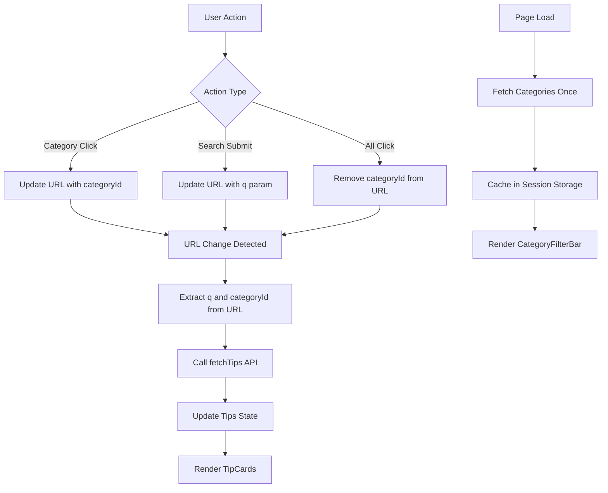

# Design Document: Search Page Category Filter

## Overview

This design implements a category filtering system for the search page that integrates seamlessly with the existing header and search functionality. The solution follows a client-side rendering approach using Next.js 14 App Router, React hooks for state management, and URL-based state persistence for shareability and browser navigation support.

The architecture consists of three main components:
1. **CategoryFilterBar** - A new reusable component for displaying and selecting categories
2. **Header** - Enhanced with conditional rendering of the category filter
3. **SearchPage** - A new page component that orchestrates search and filtering

The design leverages existing API clients, type definitions, and UI components (TipCard) to minimize code duplication and maintain consistency with the rest of the application.

## Architecture

### Component Hierarchy

```
SearchPage (app/search/page.tsx)
├── Header (showCategoryFilter={true})
│   ├── Logo
│   ├── SearchBar
│   ├── Navigation Links
│   ├── UserAvatar / Auth Buttons
│   └── CategoryFilterBar (new)
│       └── CategoryPill[] (new)
└── TipGrid
    └── TipCard[] (reused from home page)
```

### Data Flow



### State Management Strategy

The design uses a hybrid state management approach:

1. **URL as Source of Truth**: Search query (`q`) and category filter (`categoryId`) are stored in URL parameters
2. **React State for UI**: Loading states, error states, and fetched data are managed with React hooks
3. **Session Storage for Caching**: Category list is cached in session storage to avoid redundant API calls
4. **Next.js Router**: `useRouter` and `useSearchParams` hooks manage URL updates and navigation

## Components and Interfaces

### CategoryFilterBar Component

**Location**: `components/search/category-filter-bar.tsx`

**Purpose**: Displays a horizontal scrollable list of category pills with the currently selected category highlighted.

**Props Interface**:
```typescript
interface CategoryFilterBarProps {
  selectedCategoryId: string | null; // null means "All" is selected
  onCategorySelect: (categoryId: string | null) => void;
}
```

**Internal State**:
```typescript
const [categories, setCategories] = useState<Category[]>([]);
const [loading, setLoading] = useState(true);
const [error, setError] = useState<string | null>(null);
```

**Behavior**:
- Fetches categories on mount using `fetchCategories()` from `lib/api/categories.ts`
- Checks session storage for cached categories before making API call
- Stores fetched categories in session storage with key `categories_cache`
- Renders "All" pill first, followed by fetched categories
- Calls `onCategorySelect` when a pill is clicked
- Hides itself if category fetch fails (per requirements)
- Supports keyboard navigation (Tab, Arrow keys, Enter, Space)

**Accessibility Features**:
- `role="tablist"` on container
- `role="tab"` on each pill
- `aria-selected` attribute on selected pill
- `aria-label` describing the filter purpose
- `aria-live="polite"` region for announcing selection changes
- Visible focus indicators

### CategoryPill Component

**Location**: `components/search/category-pill.tsx`

**Purpose**: Renders an individual category button with optional image icon.

**Props Interface**:
```typescript
interface CategoryPillProps {
  category: Category | null; // null for "All" category
  isSelected: boolean;
  onClick: () => void;
}
```

**Rendering Logic**:
- If `category` is null: Render "All" text only
- If `category.image` exists: Render image icon (24x24px) + category name
- If `category.image` is null: Render category name only
- Apply selected styles when `isSelected` is true

**Styling**:
- Base: Rounded pill shape, padding, border
- Selected: Green background (`bg-primary`), white text
- Unselected: White background, gray text, gray border
- Hover: Slight background color change
- Focus: Ring outline for keyboard navigation
- Minimum touch target: 44x44px

### Enhanced Header Component

**Location**: `components/layout/header.tsx` (modified)

**New Prop**:
```typescript
interface HeaderProps {
  showSearchBar?: boolean;
  showCategoryFilter?: boolean; // NEW
}
```

**Changes**:
- Add `showCategoryFilter` prop with default value `false`
- Conditionally render `CategoryFilterBar` below main navigation when `showCategoryFilter` is true
- Pass necessary props to `CategoryFilterBar` (selectedCategoryId, onCategorySelect)
- Maintain all existing functionality

**Integration Point**:
```typescript
{showCategoryFilter && (
  <div className="border-t border-gray-100 py-3">
    <div className="max-w-7xl mx-auto px-4 md:px-8">
      <CategoryFilterBar
        selectedCategoryId={selectedCategoryId}
        onCategorySelect={handleCategorySelect}
      />
    </div>
  </div>
)}
```

### SearchPage Component

**Location**: `app/search/page.tsx`

**Purpose**: Main search page that orchestrates search and filtering functionality.

**URL Parameters**:
- `q` (string, optional): Search query term
- `categoryId` (string, optional): Selected category UUID

**State Management**:
```typescript
const [tips, setTips] = useState<TipSummary[]>([]);
const [loading, setLoading] = useState(true);
const [error, setError] = useState<string | null>(null);
const [pagination, setPagination] = useState<PaginationMetadata | null>(null);
```

**Hooks Used**:
- `useSearchParams()`: Read URL parameters
- `useRouter()`: Navigate and update URL
- `useEffect()`: Fetch tips when URL parameters change

**Core Logic**:

1. **URL Parameter Reading**:
```typescript
const searchParams = useSearchParams();
const searchQuery = searchParams.get('q');
const categoryId = searchParams.get('categoryId');
```

2. **Fetch Tips on Parameter Change**:
```typescript
useEffect(() => {
  const loadTips = async () => {
    setLoading(true);
    setError(null);
    
    try {
      const response = await fetchTips({
        q: searchQuery || undefined,
        categoryId: categoryId || undefined,
        pageSize: 20,
      });
      
      setTips(response.items);
      setPagination(response.metadata);
    } catch (err) {
      setError(err instanceof APIError ? err.message : 'Failed to load tips');
    } finally {
      setLoading(false);
    }
  };
  
  loadTips();
}, [searchQuery, categoryId]);
```

3. **Category Selection Handler**:
```typescript
const handleCategorySelect = (categoryId: string | null) => {
  const params = new URLSearchParams(searchParams.toString());
  
  if (categoryId) {
    params.set('categoryId', categoryId);
  } else {
    params.delete('categoryId');
  }
  
  router.push(`/search?${params.toString()}`);
};
```

4. **Search Handler** (passed to Header/SearchBar):
```typescript
const handleSearch = (query: string) => {
  const params = new URLSearchParams(searchParams.toString());
  
  if (query) {
    params.set('q', query);
  } else {
    params.delete('q');
  }
  
  router.push(`/search?${params.toString()}`);
};
```

**Rendering**:
- Header with `showCategoryFilter={true}` and `showSearchBar={true}`
- Loading state: Skeleton grid of TipCard placeholders
- Error state: Error message with retry button
- Success state: Grid of TipCard components
- Empty state: "No tips found" message

### Enhanced SearchBar Component

**Location**: `components/shared/search-bar.tsx` (modified)

**Changes**:
- Update `handleSearch` to navigate to `/search?q={query}` instead of just logging
- Preserve existing `categoryId` parameter if present in current URL
- Accept optional `onSearch` prop to allow parent components to override default behavior

**Modified Logic**:
```typescript
const handleSubmit = (e: React.FormEvent) => {
  e.preventDefault();
  
  if (onSearch) {
    // Use custom handler if provided (for SearchPage)
    onSearch(query);
  } else {
    // Default behavior: navigate to search page
    router.push(`/search?q=${encodeURIComponent(query)}`);
  }
};
```

## Data Models

### Category (from lib/types/api.ts)

```typescript
interface Category {
  id: string; // UUID
  name: string;
  createdAt: string; // ISO 8601
  updatedAt: string | null;
  image?: CategoryImage;
}

interface CategoryImage {
  imageUrl: string | null;
  imageStoragePath: string | null;
  originalFileName: string | null;
  contentType: string | null;
  fileSizeBytes: number;
  uploadedAt: string;
}
```

### TipSummary (from lib/types/api.ts)

```typescript
interface TipSummary {
  id: string; // UUID
  title: string;
  description: string;
  categoryId: string;
  categoryName: string;
  tags: string[];
  videoUrl: string | null;
  createdAt: string;
  image?: TipImage;
}
```

### PagedTipsResponse (from lib/types/api.ts)

```typescript
interface PagedTipsResponse {
  items: TipSummary[];
  metadata: PaginationMetadata;
}

interface PaginationMetadata {
  totalItems: number;
  pageNumber: number;
  pageSize: number;
  totalPages: number;
}
```

### Session Storage Schema

**Key**: `categories_cache`

**Value**:
```typescript
{
  categories: Category[];
  timestamp: number; // Unix timestamp
}
```

**Cache Invalidation**: Cache is valid for the browser session (cleared when browser/tab closes)

## API Integration

### GET /api/Category

**Client Function**: `fetchCategories()` from `lib/api/categories.ts`

**Usage**:
```typescript
import { fetchCategories } from '@/lib/api/categories';

const response = await fetchCategories();
// response: CategoryListResponse { items: Category[] }
```

**Error Handling**:
- Throws `APIError` with `problemDetails` on HTTP error responses
- Throws generic `Error` on network failures or timeouts
- Component catches errors and hides CategoryFilterBar on failure

### GET /api/Tip

**Client Function**: `fetchTips(params)` from `lib/api/tips.ts`

**Usage**:
```typescript
import { fetchTips } from '@/lib/api/tips';

const response = await fetchTips({
  q: 'cooking',
  categoryId: '123e4567-e89b-12d3-a456-426614174000',
  pageSize: 20,
  pageNumber: 1,
});
// response: PagedTipsResponse
```

**Parameters**:
- `q` (optional): Search term for title/description matching
- `categoryId` (optional): Filter by category UUID
- `pageSize` (optional): Number of results per page (default: 20)
- `pageNumber` (optional): Page number for pagination (default: 1)

**Error Handling**:
- Throws `APIError` with `problemDetails` on HTTP error responses
- Throws generic `Error` on network failures or timeouts
- Component catches errors and displays error message with retry button

## Caching Strategy

### Category List Caching

**Rationale**: Categories change infrequently, so caching reduces API calls and improves performance.

**Implementation**:
```typescript
const CACHE_KEY = 'categories_cache';

const getCachedCategories = (): Category[] | null => {
  try {
    const cached = sessionStorage.getItem(CACHE_KEY);
    if (!cached) return null;
    
    const { categories } = JSON.parse(cached);
    return categories;
  } catch {
    return null;
  }
};

const setCachedCategories = (categories: Category[]) => {
  try {
    sessionStorage.setItem(CACHE_KEY, JSON.stringify({
      categories,
      timestamp: Date.now(),
    }));
  } catch {
    // Silently fail if storage is unavailable
  }
};
```

**Cache Lifecycle**:
- Populated on first CategoryFilterBar mount
- Persists for browser session
- Cleared when browser/tab closes
- No manual invalidation needed (session-scoped)

### Tips Caching

**Decision**: No caching for tips

**Rationale**: 
- Tips are user-generated content that changes frequently
- Search results should reflect latest data
- Pagination and filtering make caching complex
- Network requests are fast enough for good UX


## Correctness Properties

A property is a characteristic or behavior that should hold true across all valid executions of a system—essentially, a formal statement about what the system should do. Properties serve as the bridge between human-readable specifications and machine-verifiable correctness guarantees.

### Property 1: Category pill rendering reflects image availability

*For any* category, when rendered as a CategoryPill, if the category has an image then both the image and name should be displayed, and if the category has no image then only the name should be displayed.

**Validates: Requirements 1.4, 1.5**

### Property 2: Selected category pill has distinct styling

*For any* category in the CategoryFilterBar, when that category is selected, the corresponding CategoryPill should have selected styling applied (green background, white text), and all other pills should have unselected styling.

**Validates: Requirements 1.8, 4.6**

### Property 3: URL parameters determine API call parameters

*For any* combination of URL parameters (q and categoryId), when the SearchPage fetches tips, the API call should include exactly those parameters that are present in the URL.

**Validates: Requirements 3.5, 3.6, 3.7**

### Property 4: Category selection updates URL and preserves search query

*For any* category selection (including "All"), when a user clicks a CategoryPill, the URL should be updated with the new categoryId (or have categoryId removed for "All"), and any existing q parameter should be preserved in the URL.

**Validates: Requirements 4.3, 4.4, 4.5**

### Property 5: Search submission updates URL and preserves category filter

*For any* search query submission, when a user submits a search from the SearchBar, the URL should be updated with the q parameter, and any existing categoryId parameter should be preserved in the URL.

**Validates: Requirements 5.1, 5.2, 5.4**

### Property 6: Keyboard selection triggers category change

*For any* CategoryPill that has focus, when the user presses Enter or Space key, the category should be selected and the URL should be updated accordingly.

**Validates: Requirements 8.2**

### Property 7: Focus indicator visibility on all pills

*For any* CategoryPill, when it receives keyboard focus, a visible focus indicator (ring outline) should be displayed.

**Validates: Requirements 8.5**

### Property 8: ARIA pressed attribute reflects selection state

*For any* CategoryPill, the aria-pressed attribute should be "true" when the pill is selected and "false" when it is not selected.

**Validates: Requirements 8.8**

## Error Handling

### Category API Failures

**Strategy**: Graceful degradation - hide the CategoryFilterBar entirely

**Rationale**: 
- Category filtering is an enhancement, not core functionality
- Users can still search without category filters
- Prevents broken UI from displaying
- Reduces user confusion

**Implementation**:
```typescript
// In CategoryFilterBar component
if (error) {
  return null; // Don't render anything
}
```

### Tip Search API Failures

**Strategy**: Display error message with retry capability

**Rationale**:
- Search results are core functionality
- Users need feedback about what went wrong
- Retry gives users control to fix transient issues

**Implementation**:
```typescript
{error && (
  <div className="text-center py-12">
    <p className="text-red-600 mb-4">{error}</p>
    <button onClick={handleRetry}>Try Again</button>
  </div>
)}
```

### Network Timeouts

**Configuration**: 10-second timeout for all API calls (using existing `API_TIMEOUT` constant)

**Error Messages**:
- Category timeout: Hide CategoryFilterBar (silent failure)
- Tip search timeout: "Request timeout - please try again"

### Session Storage Failures

**Strategy**: Silent failure with fallback to API

**Rationale**:
- Session storage may be unavailable (private browsing, storage quota)
- Caching is an optimization, not a requirement
- Fallback to API ensures functionality

**Implementation**:
```typescript
try {
  sessionStorage.setItem(CACHE_KEY, data);
} catch {
  // Silently fail, will fetch from API next time
}
```

## Testing Strategy

### Dual Testing Approach

This feature requires both unit tests and property-based tests to ensure comprehensive coverage:

**Unit Tests**: Focus on specific examples, edge cases, and integration points
- Component rendering with specific props
- Error state handling
- Loading state display
- Keyboard navigation sequences
- Browser navigation (back/forward)
- Cache hit/miss scenarios

**Property Tests**: Verify universal properties across all inputs
- Category pill rendering for any category (with/without image)
- URL parameter handling for any combination of q and categoryId
- State preservation for any search query and category selection
- Accessibility attributes for any category pill state

### Property-Based Testing Configuration

**Library**: fast-check (already in project dependencies)

**Configuration**:
- Minimum 100 iterations per property test
- Each test tagged with feature name and property number
- Tag format: `Feature: search-page-category-filter, Property {N}: {description}`

**Example Property Test**:
```typescript
import fc from 'fast-check';

// Feature: search-page-category-filter, Property 1: Category pill rendering reflects image availability
test('category pill rendering reflects image availability', () => {
  fc.assert(
    fc.property(
      fc.record({
        id: fc.uuid(),
        name: fc.string({ minLength: 1 }),
        image: fc.option(fc.record({
          imageUrl: fc.webUrl(),
          // ... other image fields
        }), { nil: null }),
      }),
      (category) => {
        const { container } = render(<CategoryPill category={category} isSelected={false} onClick={() => {}} />);
        
        if (category.image) {
          // Should have both image and name
          expect(container.querySelector('img')).toBeInTheDocument();
          expect(container).toHaveTextContent(category.name);
        } else {
          // Should have only name
          expect(container.querySelector('img')).not.toBeInTheDocument();
          expect(container).toHaveTextContent(category.name);
        }
      }
    ),
    { numRuns: 100 }
  );
});
```

### Unit Test Coverage

**CategoryFilterBar Component**:
- Renders "All" pill as first item
- Fetches categories on mount
- Uses cached categories on subsequent mounts
- Hides on API error
- Displays loading skeleton while loading
- Calls onCategorySelect when pill is clicked
- Supports Tab key navigation
- Supports Arrow key navigation
- Includes ARIA labels and live regions

**CategoryPill Component**:
- Renders "All" pill without image
- Renders category with image
- Renders category without image
- Applies selected styles when isSelected is true
- Applies unselected styles when isSelected is false
- Has minimum 44x44px touch target
- Responds to Enter key press
- Responds to Space key press

**Header Component**:
- Renders CategoryFilterBar when showCategoryFilter is true
- Does not render CategoryFilterBar when showCategoryFilter is false
- Maintains existing functionality with CategoryFilterBar present
- SearchBar remains functional with CategoryFilterBar present

**SearchPage Component**:
- Renders Header with showCategoryFilter={true}
- Fetches all tips on initial load (no params)
- Fetches tips with q parameter when present in URL
- Fetches tips with categoryId parameter when present in URL
- Fetches tips with both parameters when both present in URL
- Updates URL when category is selected
- Updates URL when search is submitted
- Preserves q when category changes
- Preserves categoryId when search changes
- Displays loading skeletons while loading
- Displays error message on API failure
- Retries API call when retry button is clicked
- Renders TipCard components for each tip
- Supports browser back button navigation
- Supports browser forward button navigation

### Integration Tests

**End-to-End Scenarios** (using Playwright):
1. Navigate to /search, verify CategoryFilterBar appears
2. Click a category, verify URL updates and results filter
3. Click "All", verify categoryId removed from URL
4. Submit search, verify q parameter added to URL
5. Select category then search, verify both parameters in URL
6. Use browser back button, verify state restored
7. Reload page with parameters, verify state persisted
8. Test keyboard navigation through categories
9. Test mobile touch scrolling

### Accessibility Testing

**Manual Testing Required**:
- Screen reader announces category selection
- Keyboard navigation works without mouse
- Focus indicators are visible
- Touch targets meet 44x44px minimum
- Color contrast meets WCAG AA standards

**Automated Accessibility Tests**:
- ARIA attributes present and correct
- Semantic HTML structure
- Focus management
- Keyboard event handlers
